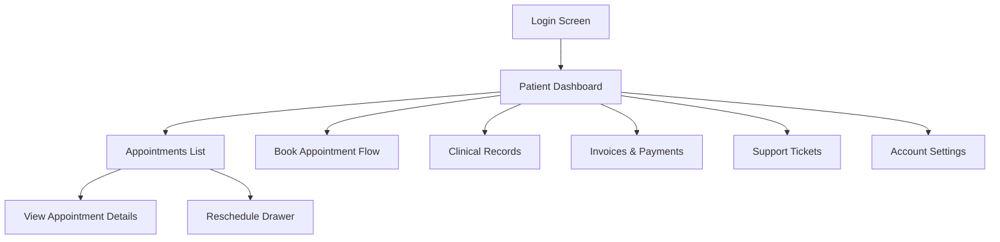

# Patient Panel – Functional Requirements Document

This document defines the functional requirements, behaviors, and design standards for the SpineCloudIQ Patient Panel, providing a comprehensive overview of the patient-facing application modules.

---

## 1. Executive Summary

The SpineCloudIQ Patient Panel is a secure, high-fidelity web application designed for chiropractic patients. It serves as a central hub for managing health journeys, enabling patients to book appointments, view clinical records, manage financial obligations, and communicate with the clinic through a modern, intuitive interface.

---

## 2. Design System & Global Standards

### 2.1 Visual Language
- **Aesthetics**: Premium, "airy" interface using Clinical Precision IQ design system.
- **Color Palette**: 
  - Primary: `#0066FF` (Brand Blue)
  - Background: `#F8FAFC` (Light Gray/White)
  - Borders: `#EFF4FF` (Soft Blue)
  - Success: `#10B981` (Emerald Green)
- **Typography**: Avenir font family for all text.
- **Navigation**: Persistent left sidebar for desktop, bottom navigation or drawer for mobile.

### 2.2 Global Components
- **Header**: Contains Logo, Entity Switcher (for development), Notifications, and User Profile menu.
- **Sidebar**: Links to Dashboard, Appointments, Clinical Records, Invoices, Tickets, and Settings.
- **Empty States**: Consistent iconography and "Call to Action" buttons for empty lists.

---

## 3. Module Breakdown

### 3.1 Patient Dashboard
**Purpose**: Centralized overview of the patient's current status and upcoming actions.

**Functional Requirements**:
- **KPI Tiles**: Real-time display of:
  - Upcoming Appointments count.
  - Past Visits summary.
  - Outstanding Balance (Payment Due).
  - Wellness Index score with trend indicator.
- **Upcoming Appointments List**: Displays the next 5 confirmed appointments with quick actions (View, Reschedule, Cancel).
- **Wellness Index Chart**: 6-month trend visualization using sparklines.
- **Date Filter**: Ability to filter dashboard data by date ranges (Last 30 days, 90 days, Year).

### 3.2 Appointment Management
**Purpose**: End-to-end workflow for scheduling and managing clinical visits.

**Functional Requirements**:
- **Table View (List Mode)**:
  - **Column Order**: Date, Time, Service, Branch, Provider, Status.
  - **Interaction**: Removed explicit "Actions" column. The **Service Name** is clickable and serves as the trigger to open Appointment Details.
  - **Status Values**: Limited to "Confirmed" and "Cancelled". "Rescheduled" is not tracked as a standalone status in the list.
- **Appointment Details (View Mode)**:
  - Displays: Date, Time, Service, Provider, Location (Branch).
  - **Actions**: Buttons for "Reschedule Appointment" and "Cancel Appointment".
  - **Exclusions**: Patient Name and "No Show" status are explicitly excluded from this view.
- **Booking Workflow**: 
  - Initiated via "Book an Appointment" button.
  - Flow mirrors the Reschedule flow:
    1. **Branch Selection** (Renamed from Clinic)
    2. **Service Selection**
    3. **Provider Selection**
    4. **Date Selection**
    5. **Time Selection**
- **Calendar View**:
  - Clicking any appointment on the calendar opens the same detailed page/drawer as defined in "Appointment Details".
- **Filters & Search**:
  - **Branch Filter**: Dropdown selection of clinical branches.
  - **Date Filter**: "From" and "To" date range selection.
  - **Search**: Text-based search by **Service Name** and **Provider Name**.

### 3.3 Clinical Records
**Purpose**: Secure access to medical documentation and progress reports.

**Functional Requirements**:
- **Document List**: Categorized view of SOAP notes, MRI reports, and X-rays.
- **Progress Tracking**: Visualization of objective findings and recovery milestones.
- **Care Plans**: View active care plans assigned by the provider, including prescribed exercises and frequency.

### 3.4 Invoices & Payments
**Purpose**: Transparent financial management and online bill payment.

**Functional Requirements**:
- **Invoice List**: Table view of all financial transactions with status badges (Paid, Unpaid, Pending Insurance).
- **Invoice Details**: Breakdowns of services rendered, insurance adjustments, and patient responsibility.
- **Payment Integration**: Ability to pay outstanding balances via integrated payment gateway (e.g., Stripe).
- **Receipts**: Downloadable PDF receipts for insurance reimbursement.

### 3.5 Support Tickets
**Purpose**: Direct communication channel for administrative or technical support.

**Functional Requirements**:
- **Ticket Creation**: Subject, Category (Billing, Technical, Medical), and Priority selection.
- **Conversation Thread**: Message-based interface for interacting with clinic staff.
- **Status Tracking**: Visual indicators for "Open", "In Progress", and "Resolved" tickets.

### 3.6 Forms & Agreements
**Purpose**: Digital intake and legal compliance management.

**Functional Requirements**:
- **Forms List**: List of required medical history and intake forms.
- **Agreements**: Digital signing of HIPAA consents, financial policies, and informed consent forms.
- **Status Indicators**: Clear "Completed" vs "Required" marking.

---

## 4. Technical Requirements & Validation

### 4.1 Authentication & Security
- Role-based access control (RBAC) ensuring patients only see their own data.
- OTP-based verification for sensitive actions (Profile updates, Password resets).

### 4.2 Form Validation
- **Real-time feedback**: Errors display inline during data entry.
- **Submission Guard**: Submit buttons remain disabled until all mandatory fields and validations are met.

---

## 5. Navigation Flow Diagram

---

## 6. Implementation Checklist

- [ ] High-fidelity Dashboard with KPI tiles.
- [ ] Multi-step Appointment Booking wizard.
- [ ] Categorized Clinical Records repository.
- [ ] Interactive Invoice management with payment status.
- [ ] Ticket-based support system.
- [ ] Responsive Layout (Mobile/Desktop).
- [ ] Integrated Notifications system.

---
